# CRUD de Productos — Reto Técnico (TISmart)

Aplicación de mantenimiento de **Productos** desarrollada en tres capas: base de datos **Oracle** (con paquete PL/SQL), API REST en **Spring Boot (Java 8)** y frontend en **Angular 17**.

> Reto técnico / Angular — Bootcamp TISmart 3.0.

---

## Tabla de contenidos

1. [Arquitectura](#arquitectura)
2. [Tecnologías](#tecnologías)
3. [Requisitos previos](#requisitos-previos)
4. [Cómo levantar el proyecto](#cómo-levantar-el-proyecto)
5. [Endpoints de la API](#endpoints-de-la-api)
6. [Reglas de negocio](#reglas-de-negocio)
7. [Pruebas de la API](#pruebas-de-la-api)
8. [Capturas del frontend](#capturas-del-frontend)
9. [Verificación del borrado lógico en BD](#verificación-del-borrado-lógico-en-bd)
10. [Decisiones de diseño](#decisiones-de-diseño)
11. [Posibles mejoras](#posibles-mejoras)

---

## Arquitectura

El proyecto sigue una arquitectura en tres capas, cada una en su carpeta:

```
BootcampTismart/
├── db/         → Scripts SQL de Oracle (tabla, secuencia, trigger, paquete)
├── backend/    → API REST en Spring Boot (Java 8)
├── frontend/   → Aplicación Angular 17 (productos-app)
└── docs/       → Capturas de las pruebas
```

Flujo de una petición:

```
Angular (4200) ──HTTP──▶ Spring Boot (8080) ──JDBC──▶ Oracle (1521)
   HttpClient          Controller → Service → Repository      Tabla PRODUCTO
```

---

## Tecnologías

| Capa | Tecnología | Versión |
|------|-----------|---------|
| Base de datos | Oracle Database XE | 21c |
| Backend | Java | 8 |
| Backend | Spring Boot | 2.7.18 |
| Backend | Spring Data JPA + Hibernate | 5.6.x |
| Backend | Driver Oracle | ojdbc8 |
| Frontend | Angular | 17 |
| Frontend | Node.js | 18+ |
| Infraestructura | Docker (Oracle XE) | — |

---

## Requisitos previos

Para ejecutar el proyecto necesitas tener instalado:

- **Docker** (para levantar Oracle XE).
- **Java 8 (JDK 1.8)**.
- **Maven** (o usar el Maven Wrapper incluido `mvnw`).
- **Node.js 18+** y **Angular CLI 17** (`npm install -g @angular/cli@17`).

---

## Cómo levantar el proyecto

> El orden es importante: primero la base de datos, luego el backend, y al final el frontend.

### 1. Base de datos (Oracle en Docker)

Levantar el contenedor de Oracle XE:

```bash
docker run -d --name oracle-tismart -p 1521:1521 -e ORACLE_PASSWORD=Oracle123 -e APP_USER=tismart -e APP_USER_PASSWORD=tismart123 gvenzl/oracle-xe:21-slim
```

Esperar a que el log muestre `DATABASE IS READY TO USE!`:

```bash
docker logs -f oracle-tismart
```

**Datos de conexión:**

| Dato | Valor |
|------|-------|
| Host | `localhost` |
| Puerto | `1521` |
| Service Name | `XEPDB1` |
| Usuario | `tismart` |
| Contraseña | `tismart123` |
| URL JDBC | `jdbc:oracle:thin:@localhost:1521/XEPDB1` |

Conectarse (con DBeaver, SQL Developer o SQL*Plus) y ejecutar los scripts de la carpeta `db/` **en orden**:

```
1. 01_tabla_producto.sql        → tabla PRODUCTO + constraint única + índice
2. 02_secuencia_trigger.sql     → secuencia SEQ_PRODUCTO + trigger de autogeneración de ID
3. 03_paquete_pkg_producto.sql  → paquete PKG_PRODUCTO con los procedimientos
4. 04_datos_prueba.sql          → 5 productos de ejemplo
```

### 2. Backend (Spring Boot)

```bash
cd backend
mvnw spring-boot:run        # Windows: mvnw   |   Linux/Mac: ./mvnw
```

La API queda disponible en **http://localhost:8080**.

> La conexión a Oracle está configurada en `backend/src/main/resources/application.properties`. `ddl-auto` está en `none` porque el esquema lo gestionan los scripts SQL.

### 3. Frontend (Angular 17)

```bash
cd frontend/productos-app
npm install                                    # solo la primera vez
ng serve --proxy-config proxy.conf.json
```

La aplicación queda disponible en **http://localhost:4200**.

> El archivo `proxy.conf.json` redirige las llamadas `/api/*` al backend en el puerto 8080, evitando problemas de CORS en desarrollo.

---

## Endpoints de la API

| Método | Endpoint | Descripción | Respuesta |
|--------|----------|-------------|-----------|
| `POST` | `/api/productos` | Crear producto | 201 Created |
| `GET` | `/api/productos?marca=&modelo=&page=&size=` | Listar (con filtro y paginación) | 200 OK |
| `GET` | `/api/productos/{id}` | Obtener por ID | 200 OK / 404 |
| `PUT` | `/api/productos/{id}` | Actualizar | 200 OK |
| `DELETE` | `/api/productos/{id}` | Borrado lógico (ESTADO='I') | 204 No Content |

**Ejemplo de cuerpo (POST / PUT):**

```json
{
  "codigo": "PROD-001",
  "nombre": "Laptop UltraSlim 15",
  "marca": "Dell",
  "modelo": "Inspiron 15 3000",
  "precio": 2499.99,
  "stock": 25
}
```

---

## Reglas de negocio

- **CODIGO único:** no se permiten dos productos activos con el mismo código → responde **409 Conflict**.
- **PRECIO ≥ 0 y STOCK ≥ 0:** valores negativos son rechazados → responde **400 Bad Request**.
- **Producto inexistente:** consultar un ID que no existe → responde **404 Not Found**.
- **Borrado lógico:** el DELETE no elimina el registro físicamente; cambia `ESTADO` de `'A'` (Activo) a `'I'` (Inactivo). El listado solo muestra productos activos.
- **Autogeneración:** el `ID_PRODUCTO` y la `FECHA_CREACION` se generan automáticamente mediante una secuencia y un trigger en Oracle.

---

## Pruebas de la API

Se probaron todos los endpoints con **Thunder Client**, incluyendo los casos de éxito y los de error.

| # | Caso | Método | Resultado esperado | Estado |
|---|------|--------|--------------------|--------|
| 1 | Listar productos (paginado) | GET | 200 + lista | ✅ |
| 2 | Obtener por ID existente | GET | 200 + producto | ✅ |
| 3 | Crear producto válido | POST | 201 + ID autogenerado | ✅ |
| 4 | Actualizar producto | PUT | 200 + fechaModif actualizada | ✅ |
| 5 | Borrado lógico | DELETE | 204 + desaparece del listado | ✅ |
| 6 | Código duplicado | POST | 409 Conflict | ✅ |
| 7 | Precio negativo | POST | 400 Bad Request | ✅ |
| 8 | ID inexistente | GET | 404 Not Found | ✅ |
| 9 | Filtro por marca | GET | 200 + solo coincidencias | ✅ |

### Listar productos (GET) — 200
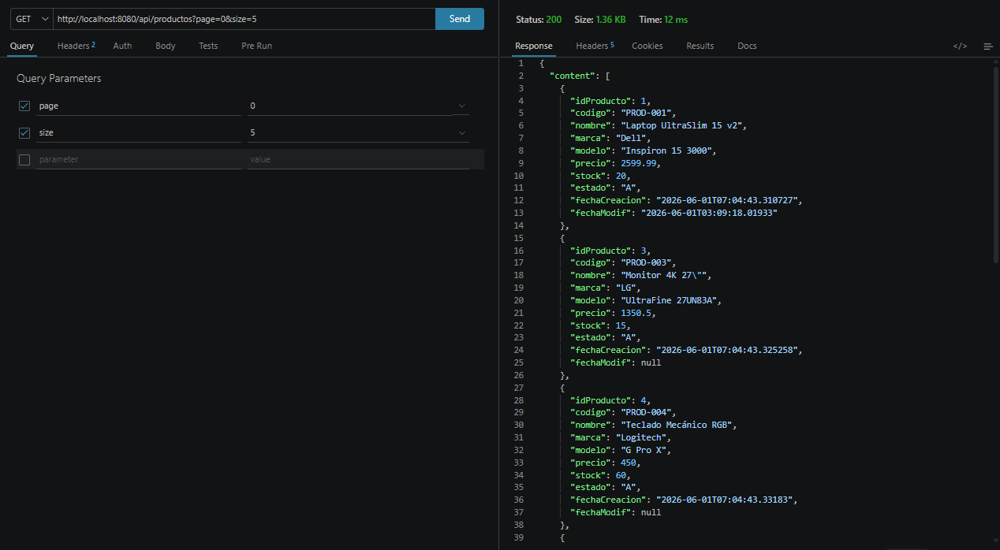

### Obtener por ID (GET) — 200
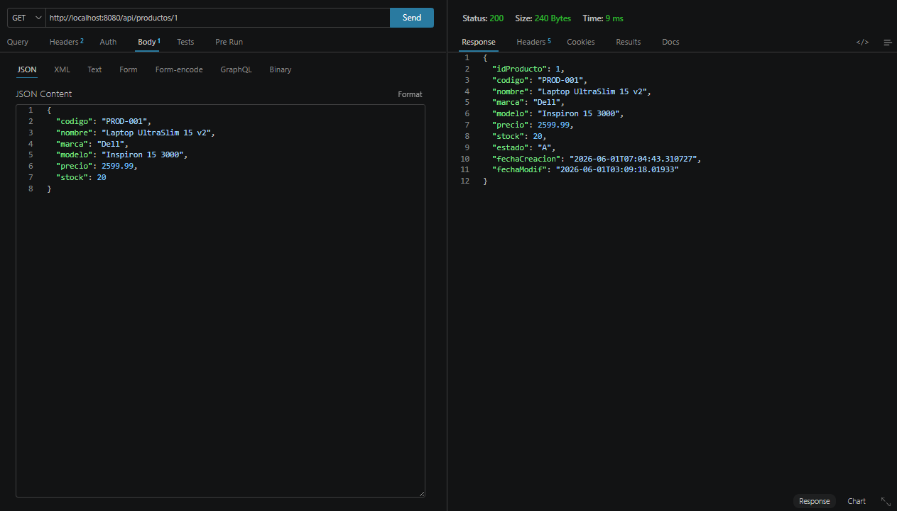

### Crear producto (POST) — 201 Created
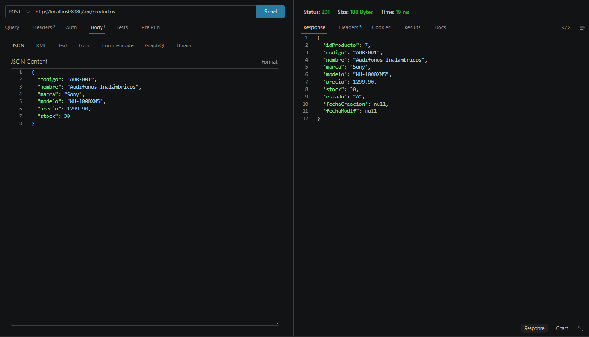

### Actualizar producto (PUT) — 200


### Borrado lógico (DELETE) — 204
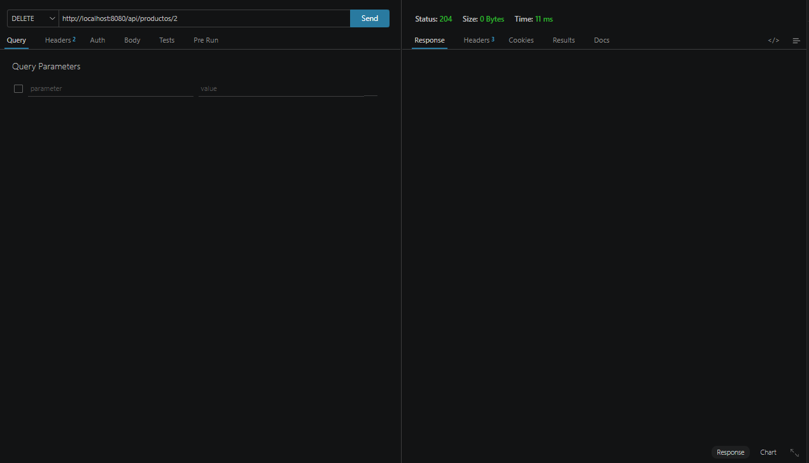

### Código duplicado — 409 Conflict
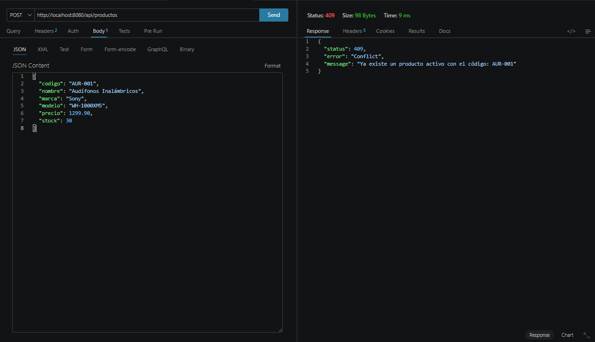

### Precio negativo — 400 Bad Request
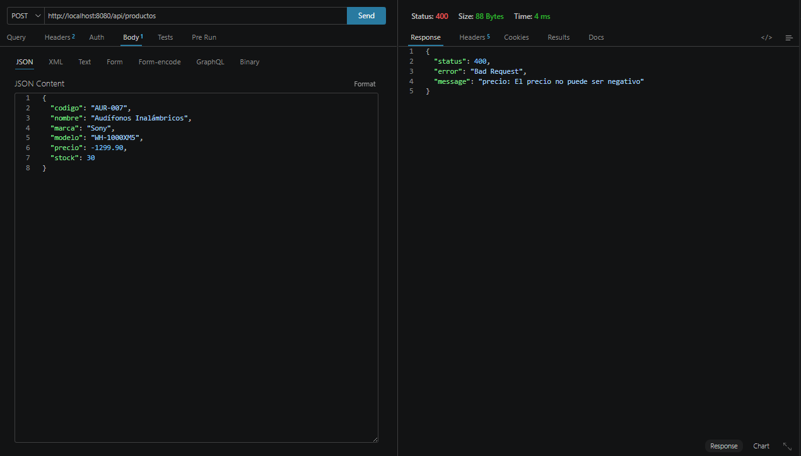

### ID inexistente — 404 Not Found
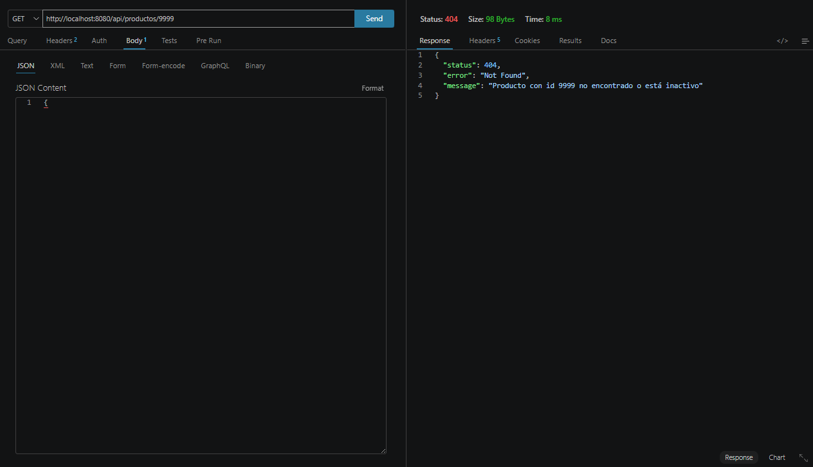

### Filtro por marca — 200
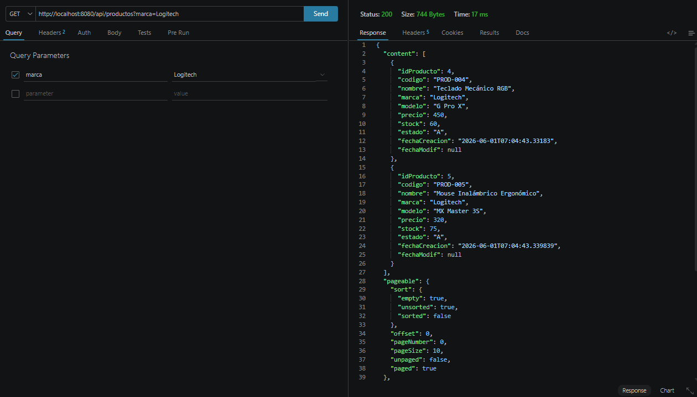

---

## Capturas del frontend

Interfaz desarrollada en Angular 17, consumiendo la API a través del proxy.

### Listado de productos
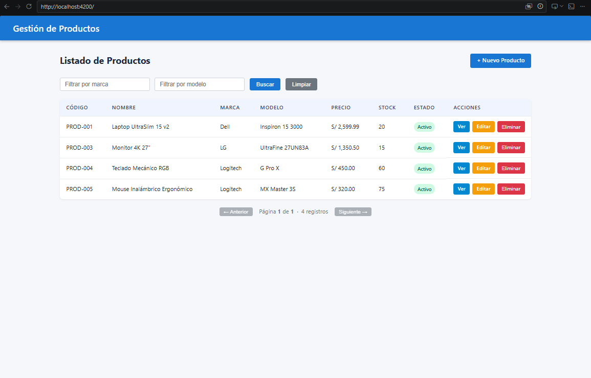

### Crear nuevo producto
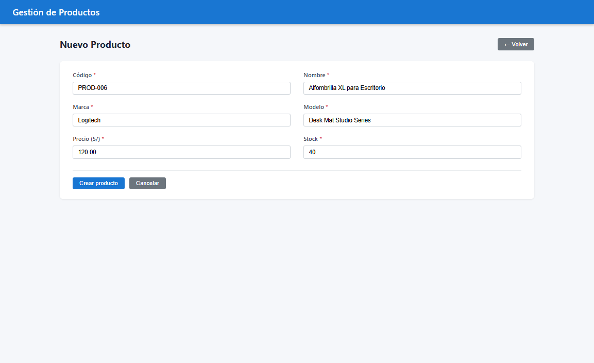

### Listado tras crear


### Detalle del producto
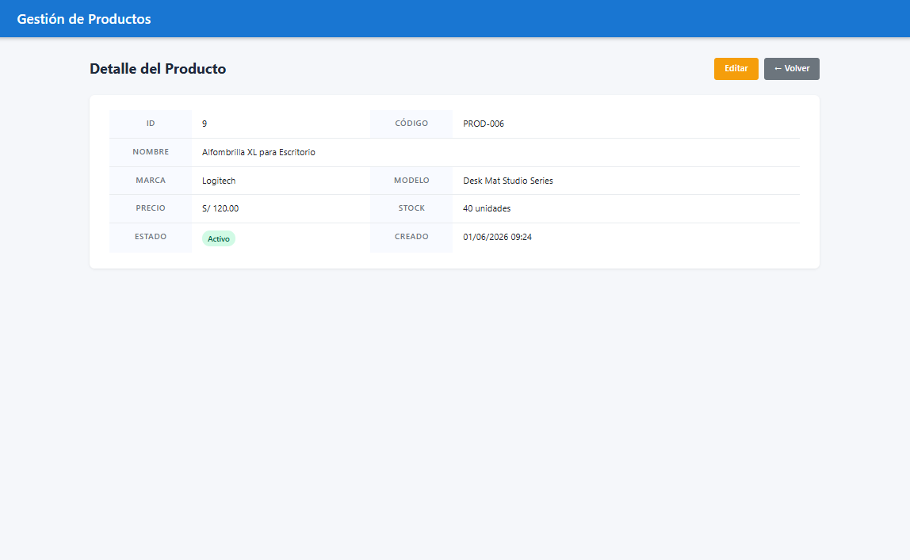

### Editar producto
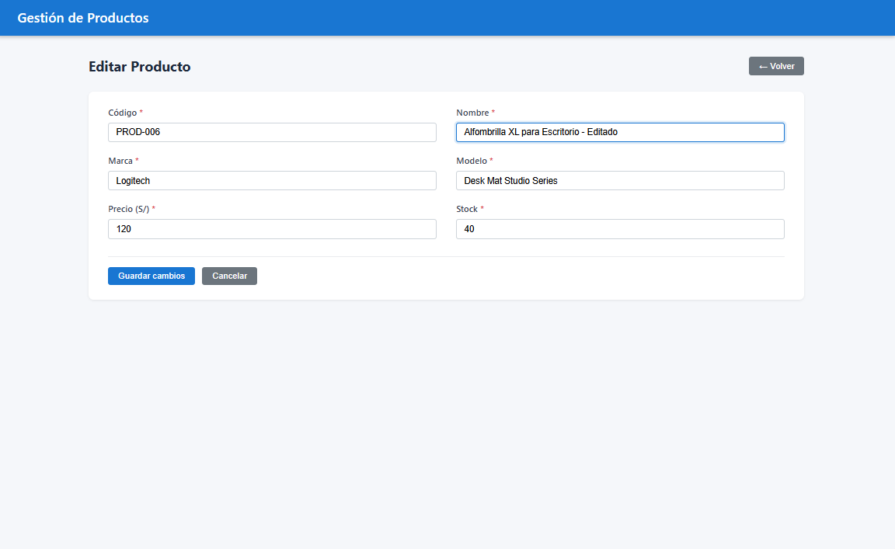

### Listado tras editar
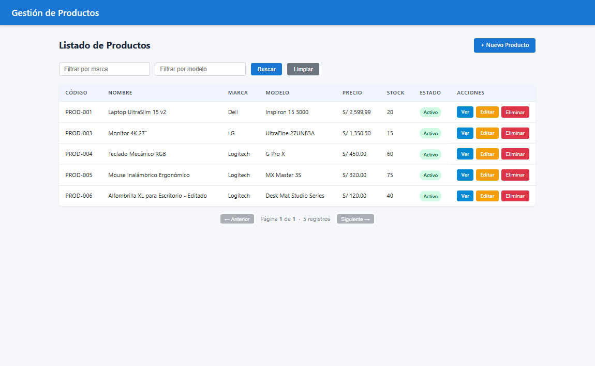

### Confirmación de eliminación
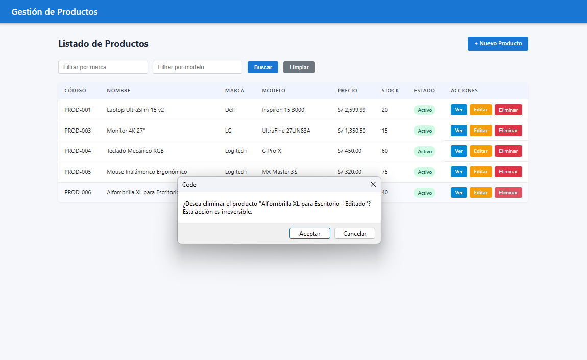

### Filtro por marca
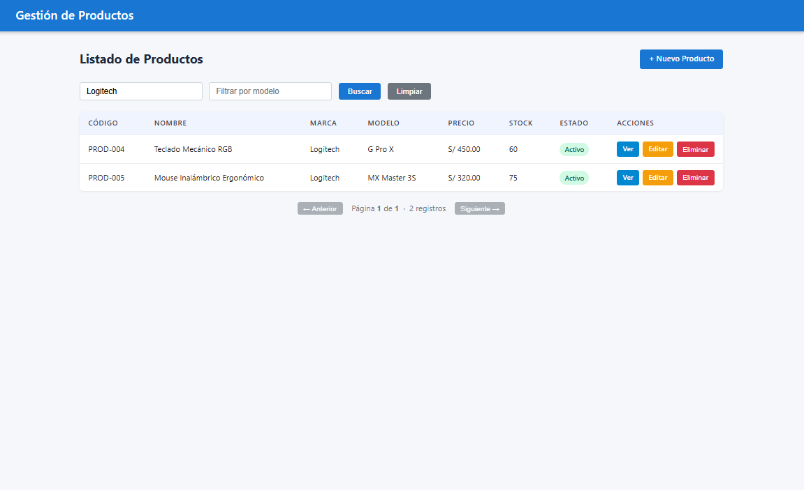

---

## Verificación del borrado lógico en BD

A diferencia de un borrado físico, el registro **no se elimina** de la tabla: solo cambia su `ESTADO` a `'I'` y se actualiza `FECHA_MODIF`. El producto deja de aparecer en el listado (que filtra `ESTADO='A'`) pero se conserva en la base de datos.

```sql
SELECT ID_PRODUCTO, CODIGO, NOMBRE, ESTADO, FECHA_MODIF
FROM PRODUCTO
WHERE ESTADO = 'I';
```

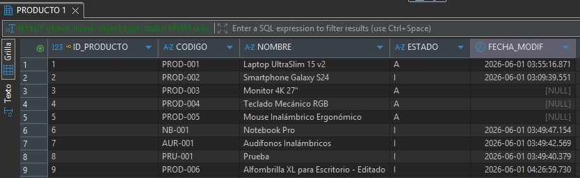

---

## Decisiones de diseño

- **Arquitectura por capas (Controller → Service → Repository):** separa responsabilidades y facilita el mantenimiento y las pruebas.
- **DTOs (ProductoRequest / ProductoResponse):** la entidad JPA no se expone directamente en la API; los DTOs controlan qué entra y qué sale, y centralizan las validaciones de entrada.
- **Manejo de errores centralizado (`@RestControllerAdvice`):** traduce las excepciones a respuestas HTTP claras (400 / 404 / 409) con mensajes descriptivos.
- **Query nativa para el listado:** el filtrado opcional por marca/modelo con paginación se implementa como query nativa, aprovechando el índice `IDX_PRODUCTO_MARCA_MODELO`.
- **Paquete PL/SQL (`PKG_PRODUCTO`):** encapsula las operaciones a nivel de base de datos, agrupando los procedimientos relacionados.
- **Borrado lógico:** se conserva el histórico de registros en lugar de eliminarlos físicamente.
- **Proxy en Angular:** simplifica el desarrollo y evita configurar CORS manualmente en el navegador.
- **Standalone components (Angular 17):** se prescinde de NgModules siguiendo el enfoque moderno de Angular.

---

## Posibles mejoras

- Añadir pruebas unitarias e integración (JUnit / Mockito en backend, Jasmine/Karma en frontend).
- Documentar la API con Swagger / OpenAPI.

---

## Autor

Leo Caballero
Reto técnico — Bootcamp TISmart 3.0
